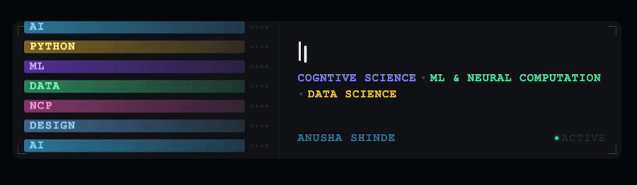

---

The problems worth solving aren't confined to a single discipline. Neither am I.

From building custom valve components, pitching accessible wireframes, to exploring HCI and machine learning at the intersection of cognition and computation, I keep finding myself drawn to one question:

> _How does the mind process and respond to the system around it, and how do we build technology that actually accounts for that?_

I’m studying Cognitive Science (Machine Learning & Neural Computation) with a minor in Data Science at UC San Diego because it's the field that rewards interdisciplinary learning.

When it comes down to it, what stays constant about my work is building things that actually matter to people.

---

## Skills

**• Languages:** 

**• Frameworks & Tools:** 

 

**• Design** 

**• AI/ML:** 

---

### Let's Connect!

